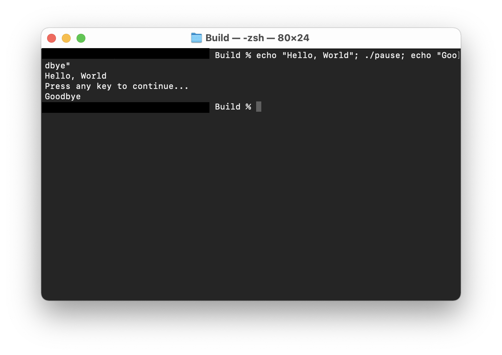

# pause

Interrupt current execution flow and request keyboard input to continue.

## `pause` vs `std::cin.get()`
`std::cin.get()` requires the user to press the Enter/Return key in order to continue. `pause`, as inspired by the Windows' `pause` command, can accept any input from the keyboard.

## License
[MIT License](LICENSE)